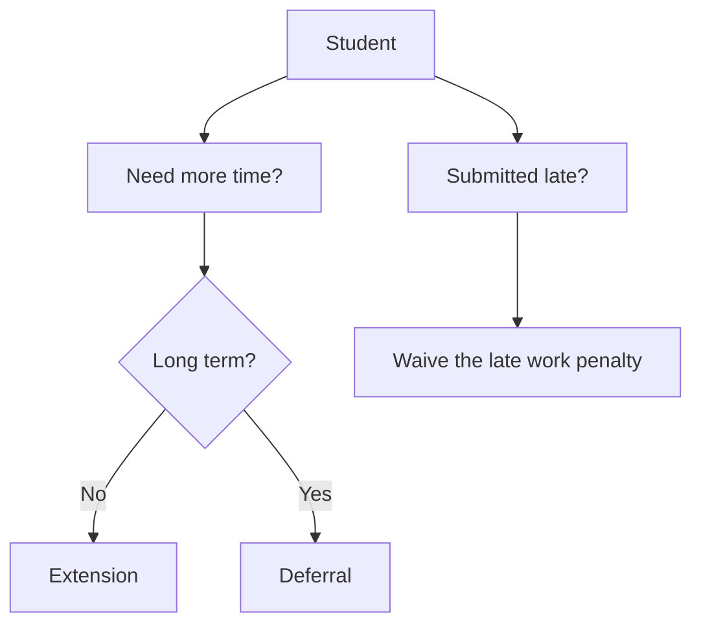

# Mitigating Circumstances
The following is research into the mitigating circumstances (MC) process across different institutions across the sector.  
The following report looks into 3 different areas:
- What systems are in place for students to apply for mitigating circumstances and/or extensions
- The transparency of the systems in place
- The ease-of-use for students
 

For this report, I have investigated the systems at the following institutions:
- [University of Chester](https://github.com/IainSimpsonCode/UCLanSU/blob/main/MC-Research.md#university-of-chester)
- [University of Cumbria](https://github.com/IainSimpsonCode/UCLanSU/blob/main/MC-Research.md#university-of-cumbria)
- [University of Manchester](https://github.com/IainSimpsonCode/UCLanSU/blob/main/MC-Research.md#university-of-manchester)

## Keywords
- Mitigating Circumstances (MC)
- Extenuating Circumstances (EC)
- Extensions
- Deferrals

## Industry Research

### University of Chester
The MC process at Chester has been replaced by a system of Extensions and Deferrals. Chester students can apply for any of the 3 following options:
- Extension
- Deferral
- Waiving of Late Work Penalty

#### Extensions
Students can recieve extensions for thier assignments for either up to 7-days, or 8 days or more. For an extension of up to 7-days, students can self-certify without having to supply evidence.[^1][^2]
Unlike the academic appeals process, extensions are handled at the academic department level, and students are not required to submit a form for a 7-day extension. Students requiring an extension of longer than 7 days must complete an online application system and provide evidence on that form. [^1]

#### Deferrals
Deferrals are a way for students to postpone thier assignment to the next assessment period. Similar to extensions, deferrals are handled by the academic departments. However, unlike extensions, deferrals always require evidence and must be submitted via an online application system. [^1]
Although you can submit for a deferral after the deadline of your coursework/exam, if your application is sucessful, you will forfiet the mark you would have been awarded. [^2]

#### Waiving of the Late Work Penalty
Students can follow the same system as the aforementioned deferrals to request the late work penalty be waived. These requests must be made through an online application and must have supporting evidence. If approved, any penalty or submitting work late will be removed and full marks will be reinstated. [^1]

#### Evaluation
Although on the surface, the system of Extensions and Deferrals is more flexible and more student focused, it lacks transparency and information. From publicly accessible resources, I can't find any information on what evidence is considered suitable and what situations would be acceptable for extensions to be considered. 
Depsite this, it is clear that the system in place at Chester is more focused on student accessibility and ease of use for students.

##### Best Elements
- More options available to students
- Clearer wording/naming

### University of Cumbria
Mitigating Circumstances at Cumbria are defined as Extenuating Circumstances (EC). These are clearly definined in Appendix 3e of the University of Cumbria Academic Procedures and Processes. [^3]
Students may also apply for extensions as defined in Appendix 3c. [^4]

#### Extenuating Circumstances
Students may submit a form [^9], with evidence, to apply for extenuating circumstances on an assessment. If sucessful, the academic board may void the assessment, meaning the student can retake the assessment, or, if the extenuating circumstance affects more than 40 credits worth of assessments, they will create an academic contract with new requirements and dates for completion for assessments. [^5][^10]

#### Extensions
While extenuating circumstances won't provide students with more time to complete thier assessment, they can seperately apply for an extension. Students may be granted an extension of up to 2 weeks, or more in exceptional circumstances. However, an extension cannot extend past the module confirmation boards. [^6] 
For an extension, students must complete a form with a reason for the extension. [^7] Students don't need to supply evidence for an extension, however may need to if they are requesting an extension of more than 2 weeks. Once completed, students send the form to the course team, who then approve the extension and forward the extension request to the Programme Administration Team. [^8] Extensions are granted at the discretion of the course team, however, appendix 3e states that extension approvals and extension length must be consistant across the course. [^6]

#### Evaluation
While the system in place at Cumbria provides less options for students, they system itself is more transparent than Chester's. Appendix 3e clearly outlines what is a valid and invalid reason for extenuating circumstances, and appendix 3c clearly outlines the process for extensions. 
The one major downside, is that the process is less student-friendly. To understand the process, students are required to read long documents filled with jargon. It is clear that the form and process was designed with the administrators in mind, rather than the students in mind.

##### Best Elements
- Clearer process
- More streamlined
- Well documented

### University of Manchester
University of Manchester provides mitigating circumstances and extensions to students. The rules for these can be found in the following documents:
- [Procedure for Extensions](https://documents.manchester.ac.uk/display.aspx?DocID=68792) [^11]
- [Mitigating Circumstances Procedure](https://documents.manchester.ac.uk/display.aspx?DocID=23163) [^13]
- [Policy on Mitigating Circumstances and Coursework Extensions](https://documents.manchester.ac.uk/display.aspx?DocID=4271) [^14]
- [A Basic Guide to Mitigating Circumstances](https://documents.manchester.ac.uk/display.aspx?DocID=23886) [^15]

#### Extensions
Extensions are usually offered for up to 5 working days, without the requirement for evidence. Longer extensions can be granted at the schools discretion. [^12] By September 2024, the university will have produced a standard form for all students to use to request extensions. [^16] In section 3.6 of the Procedure for Extensions, the university clearly describes what situations would be valid reason for extensions, and which situations would be invalid.  
Section 3.8 of the Procedure for Extensions details who considers the request. The wording is as follows: [^11]  
>
> "Requests for extensions should be considered initially by PS staff under the School’s agreed parameters. In the event of any specific requests that require academic input/decisions, PS colleagues should refer the requests to the relevant academic colleagues. Schools are responsible for confirming both the agreed parameters and the academic colleagues who would be involved in the decision-making process"  
>
This wording makes it unnecessarily unclear as to who approves each extension and who students should be submitting thier request to, but I have interpreted it as follows:  
University of Manchester uses PS as an abbreviation for Professional Services. [^17] As such, students fill in a form and submit it to professional services. The application is then reviewed centrally by them, unless the request is specific and requires academic input, in which case the school selects academics from the subject area to advise. 

#### Mitigating Circumstances
If you have any issue that affects you for more than 7 days, and affects and assignment or exam, you can apply for mitigating circumstances with evidence. Mitigating Circumstances are reviewed by a panel, and, if approved, the panel can grant an extension, a resit or excluding a mark from an average. [^18]

#### Evaluation
The system setup by Manchester is clear and simple, however has some unnecessary barriers. For example, while students can get extensions and MC's, the forms they need to complete are not readily available and the forms/rules vary at the discretion of the school. They are working on a unified extension form that will apply to all schools, however, until this is complete, the system is splintered and students cant easily find the information they need.

#### Best Elements
- Clear communication to students about the process regardless of the fact the forms required are not clearly communicated
- Extensions without evidence are allowed

### Edge Hill University
Edge Hill has recently changed thier system after receieving advice from OIA. Currently, they offer extensions and personal circumstances (mitigating circumstances). They have made thier options clear to students by providing a document explaining thier options with a flowchart[^19]. Information on thier personal circumstances policy can also be found on Appenix 7 of thier academic regulations[^20], the Students' Union website[^21] and on the Personal Circumstances form[^22].

#### Extensions
Appendix 7 of the academic regulations[^20] mentions that personal circumstances are for situations not fully addressed through the 'Extension Scheme'. This is the only time and extension 'scheme' is mentioned. Extensions are only mentioned once more in the support document[^19], however, this document only states that extensions exists and that you should email your department administrator or programme tutor for more information.  
The document states that extensios are usually for up to 2 weeks, however this does not say whether evidence is required or not.

## References
[^1]: https://www.chester.ac.uk/student-life/student-support/inclusion/faqs/
[^2]: https://www.chestersu.com/advice/academic/extensions
[^3]: https://www.cumbria.ac.uk/media/university-of-cumbria-website/content-assets/public/aqs/documents/academicregulations/Appendix-3e.pdf
[^4]: https://www.cumbria.ac.uk/media/university-of-cumbria-website/content-assets/public/aqs/documents/academicregulations/Appendix-3c.pdf
[^5]: https://www.cumbria.ac.uk/media/university-of-cumbria-website/content-assets/public/aqs/documents/academicregulations/Appendix-3c.pdf; Appendix 3e, Section 7.4.1
[^6]: https://www.cumbria.ac.uk/media/university-of-cumbria-website/content-assets/public/aqs/documents/academicregulations/Appendix-3c.pdf; Appendix 3e, Section 3.2
[^7]: https://my.cumbria.ac.uk/media/MyCumbria/Documents/Assessments/Coursework_Extension_Form.docx
[^8]: https://my.cumbria.ac.uk/Student-Life/Your-Studies/Your-Course/Assignments/
[^9]: https://my.cumbria.ac.uk/media/MyCumbria/Documents/Assessments/ExtenuatingCircumstancesForm.doc
[^10]: https://my.cumbria.ac.uk/Student-Life/Your-Studies/Assessments/Assessment-Contract/
[^11]: https://documents.manchester.ac.uk/display.aspx?DocID=68792
[^12]: https://documents.manchester.ac.uk/display.aspx?DocID=68792; Section 3.9
[^13]: https://documents.manchester.ac.uk/display.aspx?DocID=23163
[^14]: https://documents.manchester.ac.uk/display.aspx?DocID=4271
[^15]: https://documents.manchester.ac.uk/display.aspx?DocID=23886
[^16]: https://documents.manchester.ac.uk/display.aspx?DocID=68792; Footnote 2
[^17]: https://www.staffnet.manchester.ac.uk/ps/
[^18]: https://www.studentsupport.manchester.ac.uk/study-support/mitigating-circumstances/
[^19]: https://www.edgehill.ac.uk/wp-content/uploads/2023/04/Assessment-submission-process-student-version-.docx#:~:text=Late%20submission%3A%20If%20you%20have,working%20days%20of%20the%20original
[^20]: https://www.edgehill.ac.uk/wp-content/uploads/documents/Regulations_Appendix-7-Procedures-for-the-Submission-of-Personal-Circumstances-23-24-v1.pdf
[^21]: https://www.edgehillsu.org.uk/advice/academic/emc
[^22]: https://www.edgehill.ac.uk/departments/support/registry/assessments-and-awards/personal-circumstances-form/
